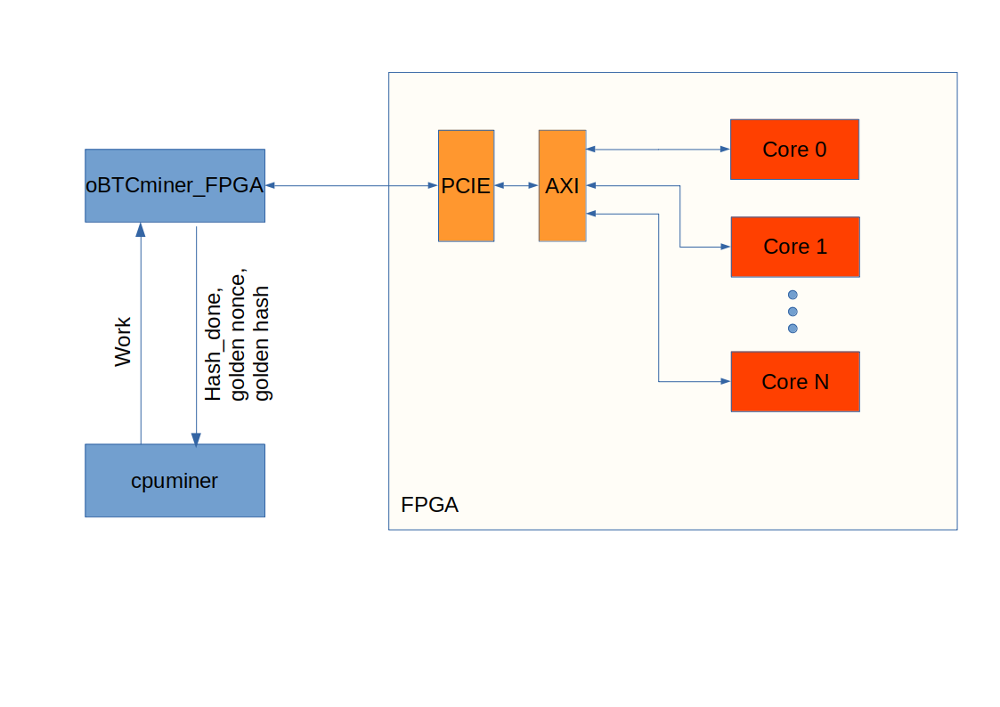
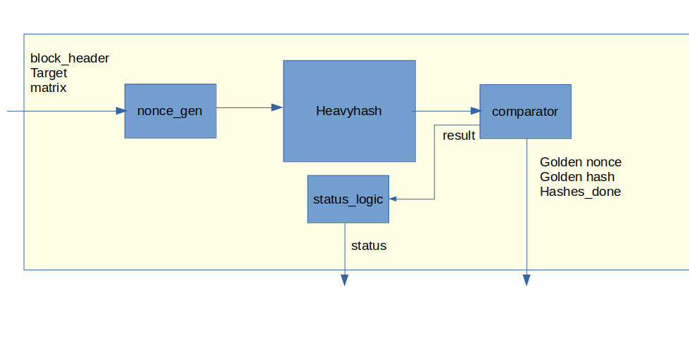
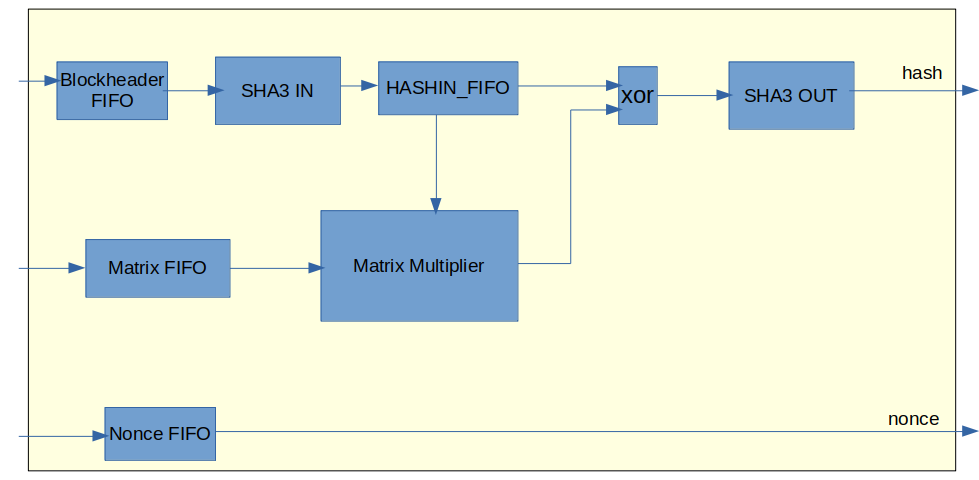

# User manual of FPGA miner

## Table of Contents

- [User manual of FPGA miner](#user-manual-of-fpga-miner)
  - [Table of Contents](#table-of-contents)
  - [Overview](#overview)
  - [Verification](#verification)
  - [Building an FPGA image](#building-an-fpga-image)
  - [Test Software](#test-software)
  - [Mining](#mining)

## Overview

FPGA miner is composed of software and hardware (FPGA) components. The block diagram of the complete system is given below.

 FPGA components are heavyhash block cores which are taking the first nonce,corresponding nonce size, block header and target parameters, then calculating the heavyhash and comparing the hashes with the target value to found a golden nonce causing the golden hash being less than the target value. Architecture of the FPGA core is given below. The core has `nonce_gen`, `heavyhash`, `status_logic` and `comparator` modules. `nonce_gen` module is resposible for taking the block header, changing the nonce value and sending it to the heavyhash module. Comparator module takes the target value from host (PC) and calculated hash values from heavyhash module and compares them. If the hash value being less than the target is found, it gives the result as 1. Otherwise the result value is 0. `comparator` also generates `hashes_done` value specifying how many hashes done. According to the result coming from `comparator` the status of the core is determined by the `status_logic`. If the result is 1, then the status will be 1 and remains 1 until the golden nonce and golden hash information is read by cpuminer. The comparator is also stopped until this read acknowledge is received. When acknowledge is received, the core continues from where it left off.  If the result is 0 and the tried nonce is less than the last nonce, the status will be 2. Otherwise, namely all the nonces are tried but no golden hash is found, then the status will be 0.
 The software is continuously read this status value. Hence, it decides what is to be done according to the status. 

Inside of the `heavyhash` module is given below. `heavyhash` module has three main parts which are `sha3_in`, `sha3_out`, `matrix_multiplier`.  `sha3_in` and `sha3_out` modules have been from https://cryptography.gmu.edu/athena/index.php?id=source_codes . Block headers are feeded to fifo before the `sha3_in`. Then `sha3_in` takes the blockheader and calculates the hash. Then sends the hash result to the matrix multiplier. Matrix multiplier takes the generated matrix value from matrix fifo and with a systolic array structure calculates the matrix multiplication. Finally, `sha3_out` takes the XOR of matrix multiplication result and hash value and calculates the heavy hash result. Each heavy hash calculation takes 25 clock cycles. Hence the hash rate can be calculated as the following formula

$$ Hash rate = \frac{Clock Frequency * Core count}{25}.$$

The software part of the system is composed of two main parts, `cpuminer` and `oBTCminer_fpga`. The two softwares are communicating between eachother with socket programming. `cpuminer` sends the first nonce, last nonce, block header, generated matrix and target parameters to `oBTCminer_fpga`. `oBTCminer` calculates the nonce size determining how many nonce to be tried by each FPGA core. The nonce size is determined by the following

$$ nonce\_size = \frac{(last\_nonce - first\_nonce + 1)}{Core\_count} + (last\_nonce - first\_nonce + 1)\ mod \ Core\_count $$

After nonce size is determined, all the inputs are sent to FPGA. Then, the status value is continuosly read. When status is 1 or 0, the loop is broken. Then, the hashes_done value, golden nonce and golden hash (if they are exist), are sent to `cpuminer`. After that, `oBTCminer_fpga` waits for the new work.

## Verification
The RTL files can be found at `aws-fpga/hdk/cl/developer_designs/oBTC_miner/design`. BefTo verify the RTL design, following steps should be done.

-   Uncomment the \`define VERIF_ lines in `wrapper_top.sv` and `heavy_hash_blk.sv`.
-   Go to `oBTCminer/software/runtime`
-   Open the `oBTCminer_fpga.c`. Make sure, the `BLK_CNT` macro is the same as the value given in `wrapper_top.sv`.
-   Go to `oBTCminer/verif/scripts`
-   Run the following command
    $ make C_TEST = oBTCminer_fpga
After that, verification is done by comparing the original heavy hash results with the results obtained by RTL design regarding the specified nonce values. If an error occurs, where the error is logged on the terminal. Since the trying all nonce values takes too  much time (days), it is better to try the nonce regions chosen randomly from the space.

## Building an FPGA image 

To build an FPGA image, the following steps are done
-   Comment the \`define VERIF_ lines in `wrapper_top.sv` and `heavy_hash_blk.sv`.
-   Run the script `aws-fpga/fpga-init.sh`
-   Go to `oBTCminer/build/scripts`
-   Run the following command
    -   $ ./aws_build_dcp_from_cl.sh -strategy TIMING -clock_recipe_a A0 -clock_recipe_b B5
    -  where A0 and B5 correspond to 125MHz and 400MHz, respectively. To change this parameters check the following link https://github.com/aws/aws-fpga/blob/master/hdk/docs/clock_recipes.csv) 
  
After running this command, regarding to core count, the implementation time changes. For 40 Cores, it takes about 9 hours. After, built is done. To generate the FPGA image following steps are done
-  Run the following commands
   -  $ aws s3 cp ~/src/project_data/github/aws-fpga/hdk/cl/developer_designs/oBTC_miner/build/checkpoints/to_aws/`built-name`.Developer_CL.tar  s3://mybucket-egoncu/dcp/ 
   -  aws ec2 create-fpga-image --region us-east-1 --name `image_name` --input-storage-location Bucket=mybucket-egoncu,Key=dcp/`built-name` --logs-storage-location Bucket=mybucket-egoncu,Key=logs

  where `built-name` should be replaced the name of the file generated after implementation, `image_name` can be any given name for the image. After running these commands, it takes about 40 minutes to have the available FPGA image.

  To download the FPGA image, following steps are done
  - $ sudo fpga-clear-local-image -S 0
  - $ sudo fpga-load-local-image -S 0 -I agfi-02242ecde389dc834 -a 125 -b 343 -c 1

where the argument beginning with `agfi` is belong to the FPGA image.

## Test Software

There is a test software, to make sure the FPGA cores are working after the image is downloaded to the card. The codes of the software can be found at the following path `oBTCminer/software/runtime`. After needed modifications are done on the codes, the following steps are done to compile and run the test software.
-   Go to `oBTCminer/software/runtime`
-   Run the following commands
    -   $ make
    -   $ sudo ./oBTCminer_fpga
    - 

## Mining

FPGA miner uses the FPGA hardware cores and the software controlling these cores named `cpu_miner`.  The work is recevied by `cpuminer` and distributed to the FPGA cores. To do that, the thread count is fixed to FPGA core count (40) at `cpuminer`. Also, the normally used `heavyhash function` is modified to use FPGA cores. But all the FPGA cores can be acessed by PCIE interface and at the same time only one thread can access the PCIE, the mutex lock and unlock functions are used very carefully.  All the possible hashes can be done for a work in 7 seconds. But normally, all threads normally get work in every 1 minute. To overcome this issue, at the cpuminer code, it is changed to get the work (using stratum_gen_work() function) in every 7 seconds.

To run the FPGA miner, follow the below steps:

- Open a terminal and connect to the instance with ssh protocol.
- At the instance, open home folder. Run the following command:
    - $ source fpga_init.sh
- After previous command, the current directory is oBTCminer. Go to the top folder of the repository (`aws-fpga`).
- Open `opowminer` folder.
- Run the following commands. After these commands, the FPGA will be programmed.
    - $ sudo fpga-clear-local-image -S 0
    - $ sudo fpga-load-local-image -S 0 -I agfi-09b1521d93088246c -a 125 -b 343 -c 1
- Run  `$ ./build.sh` command to compile cpuminer.
- Run the following command:
    - `$ ./cpuminer -o stratum+tcp://pool.obtc.me:3390 -u [oBTC address] -p . -a heavyhash -D`

After these steps, the mining is started.